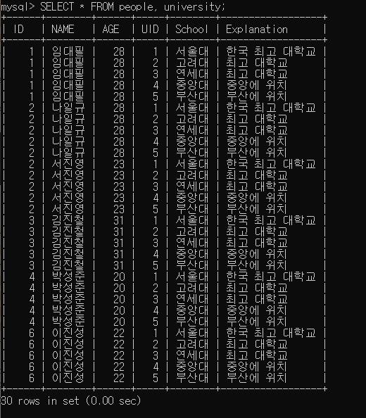
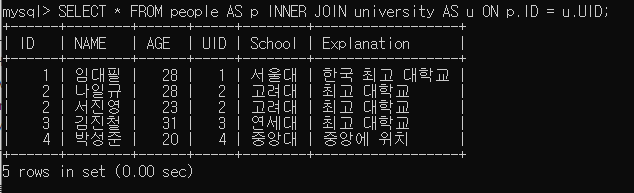
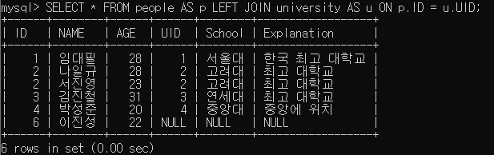

# 04. DATABASE

<details>
<summary style="font-size: 1.5em; font-weight: bold;">SQL 정의 및 특성</summary>

## SQL이란?

---

SQL은 **Structured Query Language(구조적 질의 언어)의 줄임말로, 관계형 데이터베이스 시스템(RDBMS)에서 자료를 관리 및 처리하기 위해 설계된 언어**이다.

자료의 검색과 관리, 데이터베이스 스키마 생성과 수정, 데이터베이스 객체 접근 조정 관리를 위해 고안되었다.

## SQL의 종류

---

| 명령어 종류        | 명령어                      | 설명                                                         |
|---------------| ------------------------- | ------------------------------------------------------------ |
| 데이터 정의, DDL(Data Definition Language)  | CREATE, ALTER, DROP, RENAME, TRUNCATE | 테이블과 같은 데이터 구조를 정의하는데 사용되는 명령어들로 그러한 구조를 생성, 변경, 삭제, 이름을 바꾸는 데이터 구조와 관련된 명령 |
| 데이터 조작어, DML(Data Manipulation Language)  | SELECT, INSERT, UPDATE, DELETE | 데이터베이스에 들어 있는 데이터를 조회 및 검색하는 명령. 데이터베이스의 테이블에 들어 있는 데이터에 변형을 가하는 명령(삽입, 수정, 삭제) |
| 데이터 제어어, DCL(Data Control Language)  | GRANT, REVOKE            | 데이터베이스에 접근하고 객체들을 사용하도록 권한을 주고 회수하는 명령 |
| 트랜잭션 제어어, TCL(Transaction Control Language) | COMMIT, ROLLBACK, SAVEPOINT | 논리적인 작업의 단위를 묶어 데이터 조작어(DML)에 의해 조작된 결과를 작업단위(트랜잭션) 별로 제어하는 명령 |


## SQL의 언어적 특정

---

### 1. SQL은 대소문자를 가리지 않는다.

단, 서버 환경이나 DBMS 종류에 따라 데이터베이스 또는 필드명에 대해 대소문자를 구분하기도 한다.

### 2. SQL 명령은 반드시 세미콜론(;)으로 끝나야 한다.

### 3. 고유의 값은 따옴표(’ ‘)로 감싸준다.

예를 들어, *SELECT * FROM EMP WHERE NAME=’coco’;*

### 4. 객체를 나타낼 때는 백틱(` `)으로 감싸준다.

예를 들어, *SELECT `COST`, `TYPE` FROM ÌNOVOICE`;*

### 5. 주석은 일종의 도움말로, 주석 처리된 문장은 프로그램에서 동작하지 않는다.

한 줄 주석은 문장 앞에 --를 붙여서 사용한다.

예를 들어, *--SELECT * FROM EMP;* → 해당 쿼리는 실행되지 않는다.

### 6. 여러 줄 주석은 /* */으로 감싸준다.

예를 들어, */* SELECT * FROM EMP; */*

</details>

<br>

## 1. 데이터 정의 언어, DDL

<details>
<summary style="font-size: 1.5em; font-weight: bold;">CREATE 명령어</summary>
</details>

<br>

<details>
<summary style="font-size: 1.5em; font-weight: bold;">DROP 명령어</summary>
</details>

<br>

<details>
<summary style="font-size: 1.5em; font-weight: bold;">ALTER 명령어</summary>
</details>

<br>

<details>
<summary style="font-size: 1.5em; font-weight: bold;">데이터 타입</summary>
</details>

<br>

## 2. 데이터 조작 언어, DML

<details>
<summary style="font-size: 1.5em; font-weight: bold;">조건에 따른 SELECT문 활용</summary>

**SELECT** 문은 기본적으로 데이터를 검색하는 기능으로 CRUD 중 READ에 해당되는 기능을 수행한다.

기본적인 구문은 다음과 같다.

```sql
SELECT (속성1, 속성2, . . .)
FROM (테이블명)
WHERE (조건식);
```

(조건식)에 의해 해당하는 행(가로)을 선택하고 (속성1, 속성2, …)에 의해 열(세로)을 보여준다.

```sql
SELECT *
FROM (테이블명);
```

WHERE 조건문이 없으므로 모든 행을 선택하고, *을 통해 모든 열을 보여준다.

즉, (테이블명)의 이름을 가진 테이블의 모든 데이터를 확인하는 명령어이다.

---

```sql
SELECT *
FROM (테이블명)
WHERE (조건1)
  AND (조건2);
```

(테이블명)의 테이블에서 (조건1)과 (조건2)를 모두 만족하는 행의 모든 열을 보여준다.

```sql
SELECT *
FROM (테이블명)
WHERE (속성1) BETWEEN (값1) AND (값2);
```

(테이블명)의 테이블에서 (속성1)의 값이 (값1)과 (값2)의 사이인 행의 모든 열을 보여준다.

아래의 명령어를 예로 비교해보자.

```sql
SELECT *
FROM Company
WHERE age > 23
  AND age < 35;
```

```sql
SELECT *
FROM Company
WHERE age BETWEEN 23 AND 35;
```

두 명령어를 통한 결과 값은 같지만 성능은 **BETWEEN**을 사용한 명령어가 더 좋다.

단순히 AND만 사용한 첫 번째 쿼리는 전체 데이터에서 age가 23보다 큰 값과 35보다 작은 데이터를 각각 구해 이들의 교집합을 구하는 연산이다.

반면, BETWEEN을 사용한 두 번째 쿼리는 age라는 속성에서 23이라는 값부터 시작하여 35라는 값보다 작은 값을 찾는 연산이기 때문이다.

---

```sql
SELECT *
FROM (테이블명)
WHERE (조건1)
   OR (조건2);
```

(테이블명)의 테이블에서 (조건1)과 (조건2) 중 하나라도 만족하는 행의 모든 열을 보여준다.

```sql
SELECT *
FROM (테이블명)
WHERE (속성1) IN (조건1, 조건2, . . .);
```

```sql
SELECT *
FROM (테이블명)
WHERE (속성1) NOT IN (조건1, 조건2, . . .);
```

(테이블명)의 테이블에서 (속성1)의 값이 (조건1)이거나 (조건2)인 행의 모든 열을 보여준다.

(테이블명)의 테이블에서 (속성1)의 값이 (조건1)이거나 (조건2)에 포함되지 않는 값을 보여준다.

여기서 IN을 사용한 구문 또한 BETWEEN을 사용한 구문과 같이 OR보다 성능이 좋다.

아래의 명령어를 예로 비교해보자.

```sql
SELECT *
FROM Company
WHERE age = 23
   OR age = 24
   OR age = 25;
```

```sql
SELECT *
FROM Company
WHERE age IN (23, 24, 25);
```

두 명령어를 통한 결과 값은 같지만 성능은 IN을 사용한 명령어가 더 좋다.

---

```sql
SELECT *
FROM (테이블명)
WHERE NOT (조건1);
```

(테이블명)의 테이블에서 (조건1)을 만족하지 않는 행의 모든 열을 보여준다.

```sql
SELECT *
FROM (테이블명)
WHERE (속성1) LIKE 'A_';
```

(테이블명)의 테이블에서 (속성1) 중 ‘A + 1 글자’ 값을 가진 행의 모든 열을 보여준다.

```sql
SELECT *
FROM (테이블명)
WHERE (속성1) LIKE 'A__';
```

(테이블명)의 테이블에서 (속성1) 중 ‘A + 2 글자’ 값을 가진 행의 모든 열을 보여준다.

---

```sql
SELECT *
FROM (테이블명)
WHERE (속성1) LIKE 'A%';
```

(테이블명)의 테이블에서 (속성1) 중 ‘A’로 시작하는 값을 가진 행의 모든 열을 보여준다.

```sql
SELECT *
FROM (테이블명)
WHERE (속성1) LIKE '%A';
```

(테이블명)의 테이블에서 (속성1) 중 ‘A’로 끝나는 값을 가진 행의 모든 열을 보여준다.

```sql
SELECT *
FROM (테이블명)
WHERE (속성1) LIKE '%A%';
```

(테이블명)의 테이블에서 (속성1) 중 ‘A’를 포함하는 값을 가진 행의 모든 열을 보여준다.

---

```sql
SELECT *
FROM (테이블명)
ORDER BY (속성1) (순서);
```

(테이블명)의 테이블에서 (속성1)의 (순서)에 따라 모든 열을 보여준다.

이때 (순서)에는 DESC(내림차순) 또는 ASC(오름차순)을 입력하며 이를 생략시 default는 ASC(오름차순)이다.

```sql
SELECT (속성1) AS '별명1', (속성2) AS '별명2',
FROM (테이블명);
```

(테이블명)의 테이블에서 (속성1)은 별명1이란 이름으로, (속성2)는 별명2라는 이름으로 보여준다.

```sql
SELECT DISTINCT (속성1), (속성2), ...FROM (테이블명);
```

(테이블명)의 테이블에서 (속성1), (속성2), … 를 선택하는 데 이때 중복되는 값은 제외하고 보여준다.

</details>

<br>

<details>
<summary style="font-size: 1.5em; font-weight: bold;">INSERT문 활용</summary>
</details>

<br>

<details>
<summary style="font-size: 1.5em; font-weight: bold;">UPDATE 활용</summary>
</details>

<br>

<details>
<summary style="font-size: 1.5em; font-weight: bold;">DELETE 활용</summary>
</details>

<br>

<details>
<summary style="font-size: 1.5em; font-weight: bold;">INSERT문 활용</summary>
</details>

<br>

<details>
<summary style="font-size: 1.5em; font-weight: bold;">JOIN - INNER, LEFT, RIGHT문 활용</summary>

JOIN 연산은 두 테이블을 결합하는 연산이다.

데이터의 규모가 커지면서 하나의 테이블로 정보를 수용하기 어려워지면 테이블을 분할하고 테이블 간의 관계성을 부여한다.

아래의 사람(PEOPE), 대학교(UNIVERSITY) 두 테이블을 이용해 JOIN 연산을 살펴보자.

```sql
CREATE TABLE PEOPLE
(
    ID   INT         NOT NULL,
    NAME VARCHAR(50) NOT NULL,
    AGE  INT,
    PRIMARY KEY (ID, NAME)
);
```

```sql
CREATE TABLE UNIVERSITY
(
    UID         INT         NOT NULL,
    SCHOOL      VARCHAR(50) NOT NULL,
    EXPLANATION VARCHAR(100),
    PRIMARY KEY (UID)
);
```

```sql
-- PEOPLE 테이블에 데이터 삽입
INSERT INTO PEOPLE (ID, NAME, AGE)
VALUES (1, '임대필', 28);
INSERT INTO PEOPLE (ID, NAME, AGE)
VALUES (2, '나일규', 28);
INSERT INTO PEOPLE (ID, NAME, AGE)
VALUES (2, '서진영', 23);
INSERT INTO PEOPLE (ID, NAME, AGE)
VALUES (3, '김진철', 31);
INSERT INTO PEOPLE (ID, NAME, AGE)
VALUES (4, '박성준', 20);
INSERT INTO PEOPLE (ID, NAME, AGE)
VALUES (5, '이진성', 22);

-- UNIVERSITY 테이블에 데이터 삽입
INSERT INTO UNIVERSITY (UID, SCHOOL, EXPLANATION)
VALUES (1, '서울대', '한국 최고 대학교');
INSERT INTO UNIVERSITY (UID, SCHOOL, EXPLANATION)
VALUES (2, '고려대', '최고 대학교');
INSERT INTO UNIVERSITY (UID, SCHOOL, EXPLANATION)
VALUES (3, '연세대', '최고 대학교');
INSERT INTO UNIVERSITY (UID, SCHOOL, EXPLANATION)
VALUES (4, '중앙대', '중앙에 위치');
INSERT INTO UNIVERSITY (UID, SCHOOL, EXPLANATION)
VALUES (5, '부산대', '부산에 위치');
```

## JOIN의 종류


INNER JOIN & OUTER JOIN

---

### 1. CROSS JOIN

두 테이블의 교집합을 수행하는 교차 결합이다.

```sql
SELECT *
FROM PEOPLE,
     UNIVERSITY;
SELECT *
FROM PEOPLE
         CROSS JOIN UNIVERSITY;
```



---

JOIN을 하면 두 테이블을 결합한 데이터가 조회된다. 이처럼 두 테이블에서 모든 경우의 수를 볼 수 있다.

다만, 모든 경우의 수를 볼 일이 딱히 없기 때문에 실제로 거의 사용되지 않는다.

### 2. INNER JOIN

서로 중복되는 값만 나타낸다.

```sql
SELECT *
FROM PEOPLE AS P
         INNER JOIN UNIVERSITY AS U ON P.ID = U.UID;

#
INNER
생략 가능
SELECT *
FROM PEOPLE AS P
         JOIN UNIVERSITY AS U ON P.ID = U.UID;
```

---

INNER JOIN은 좌우에 결합할 테이블명을 작성하고, AS로 별명을 붙여주고 ON 뒤에는 결합 조건을 명시한다.



---

위와 같이 특정 컬럼이 같은 데이터를 조회하도록 조건을 추가시킨 결합을 동등 결합(EQUI JOIN)이라고 한다.

JOIN에서 가장 많이 사용되는 것이 EQUI JOIN이다.

EQUI JOIN을 수행해서 PEOPLE 테이블의 ID가 6인 데이터와 UNIVERSITY 테이블의 UID가 5인 데이터는 결과에서 제외된 것을 확인할 수 있다.

결론은 JOIN하는 두 개의 테이블 모두에 데이터가 존재하는 행에 대해서만 결과를 가져온다.

### 3. LEFT JOIN

매칭되는 행이 없어도 결과에 포함시키고, 없는 경우 NULL로 표시해준다.

위의 예제를 LEFT JOIN으로 적용시켜 살펴보자.

```sql
SELECT *
FROM PEOPLE AS P
         LEFT JOIN UNIVERSITY U ON P.ID = U.UID;
```



---

PEOPLE 테이블의 ID가 6인 데이터도 UNIVERSITY와 매칭되는게 없지만, 결과에 포함되었다.

그 이유는 LEFT JOIN 즉, 왼쪽 테이블(PEOPLE)을 기준으로 하였기 때문이다.

반면, UNIVERSITY 테이블의 UID가 5인 데이터는 PEOPLE ID가 5인 데이터가 없기 때문에 NULL로 처리되어서 조회되는 것을 확인할 수 있다.

### 4. RIGHT JOIN

매칭되는 행이 없어도 결과에 포함시키고, 없는 경우 NULL로 표시해준다.

```sql
SELECT *
FROM PEOPLE AS P
         RIGHT JOIN UNIVERSITY U ON P.ID = U.UID;
```


---

LEFT JOIN과 반대 형태로 조회되는 것을 확인할 수 있다.

</details>

<br>

<details>
<summary style="font-size: 1.5em; font-weight: bold;">IS NULL, IFNULL, COALESCE문 활용</summary>
</details>

<br>

<details>
<summary style="font-size: 1.5em; font-weight: bold;">GROUP BY문 활용</summary>
</details>

<br>

<details>
<summary style="font-size: 1.5em; font-weight: bold;">COUNT, SUM, MAX, MIN 집계함수 활용</summary>
</details>

<br>

<details>
<summary style="font-size: 1.5em; font-weight: bold;">UNION & UNION ALL문 활용</summary>
</details>

<br>

## 3. 데이터 제어 언어, DCL

<details>
<summary style="font-size: 1.5em; font-weight: bold;">GRANT 명령어</summary>
</details>

<br>

<details>
<summary style="font-size: 1.5em; font-weight: bold;">REVOKE 명령어</summary>
</details>

<br>

## 4. 트랜잭션 제어 언어, TCL

<details>
<summary style="font-size: 1.5em; font-weight: bold;">COMMIT 명령어</summary>
</details>

<br>

<details>
<summary style="font-size: 1.5em; font-weight: bold;">ROLLBACK 명령어</summary>
</details>

<br>

<details>
<summary style="font-size: 1.5em; font-weight: bold;">SAVEPOINT 명령어</summary>
</details>

<br>

## 5. 기타 명령어

<details>
<summary style="font-size: 1.5em; font-weight: bold;">USE 명령어</summary>
</details>

<br>

<details>
<summary style="font-size: 1.5em; font-weight: bold;">SHOW 명령어</summary>
</details>

<br>


## 참고 자료

---

- [[MySQL] 조건에 따른 SELECT문 활용](https://dev-coco.tistory.com/57)
- [[MySQL] 조인(JOIN) - (INNER, LEFT, RIGHT)](https://dev-coco.tistory.com/59)
- [[MySQL] SQL 정의 및 특성 ()](https://dev-coco.tistory.com/56)
